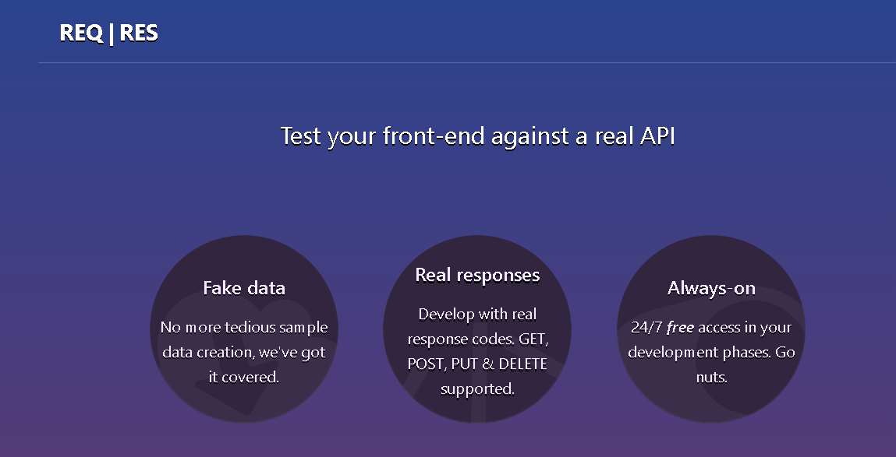
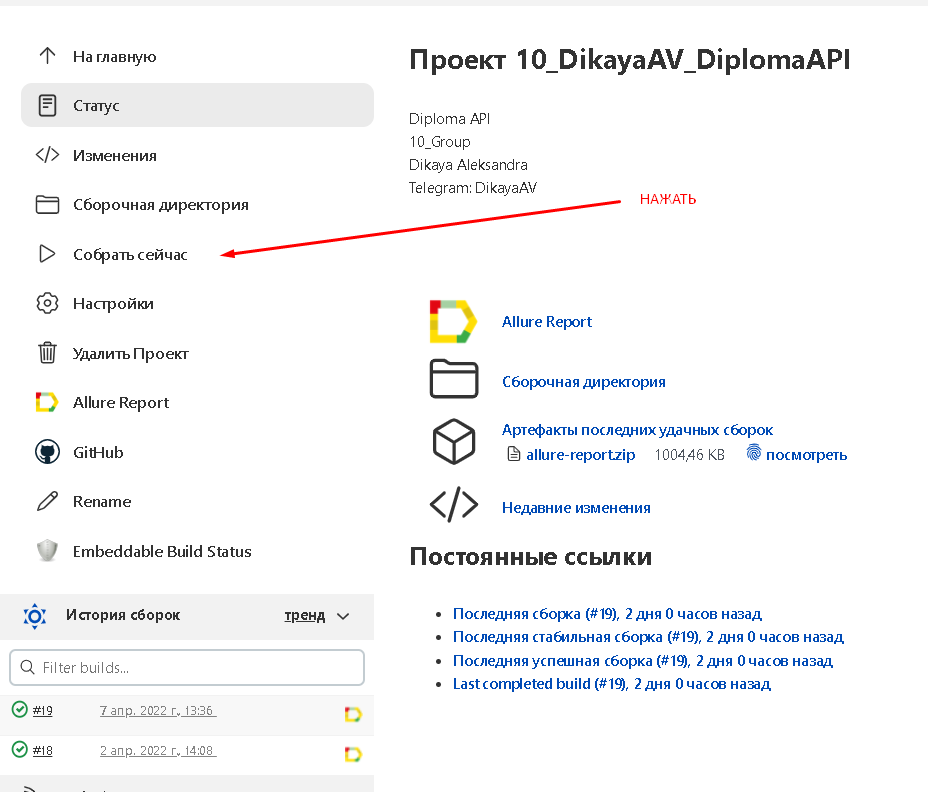
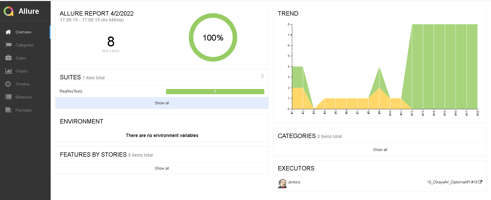
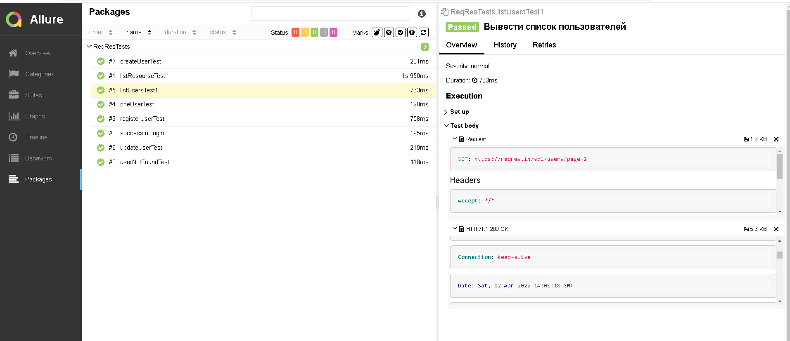
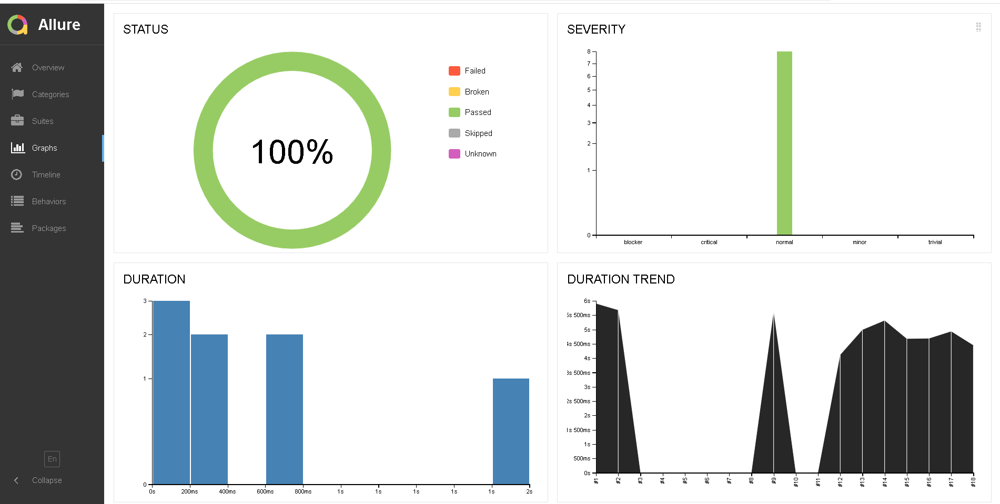
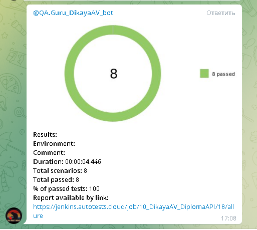

# Проект по автоматизации API тестов сайта Reqres
<a target="_blank" href="https://reqres.in/">Веб сайт Reqres</a>

<p align="center">

</p>

## :drop_of_blood: Содержание:

- [Технологии и инструменты](#earth_africa-технологии-и-инструменты)
- [Реализованные проверки](#earth_africa-Реализованные-проверки)
- [Сборка в Jenkins](#earth_africa-Jenkins-job)
- [Запуск из терминала](#earth_africa-Запуск-тестов-из-терминала)
- [Allure отчет](#earth_africa-Allure-отчет)
- [Отчет в Telegram](#earth_africa-Уведомление-в-Telegram-при-помощи-бота)

## :bird: Технологии и инструменты

<p align="center">
<a href="https://www.jetbrains.com/idea/"></a>
<a href="https://www.java.com/"></a>
<a href="https://github.com/"></a>
<a href="https://junit.org/junit5/"></a>
<a href="https://gradle.org/"></a>
<a href="https://selenide.org/"></a>
<a href="https://github.com/allure-framework/allure2"></a>
<a href="https://www.jenkins.io/"></a>
</p>

## :boom: Реализованные проверки

- ✓ Поиск информации по id пользователя
- ✓ Вывести список пользователей
- ✓ Вывести список ресурсов
- ✓ Создание пользователя
- ✓ Регистрация пользователя
- ✓ Обновление информации пользователя
- ✓ Поиск несуществующего пользователя
- ✓ Успешная авторизация пользователя

## :heavy_heart_exclamation: Запуск тестов
### Локальный запуск (через терминал):
```
gradle clean test
```
### </a> Удаленный запуск <a target="_blank" href="https://jenkins.autotests.cloud/job/10_DikayaAV_DiplomaAPI/"> (через Jenkins) </a>. Нажать на кнопку Собрать : 
<p align="center">
<a href="https://jenkins.autotests.cloud/job/10_DikayaAV_diploma/"></a>
</p>

## </a> Отчет в <a target="_blank" href="https://jenkins.autotests.cloud/job/10_DikayaAV_DiplomaAPI/allure/">Allure report</a>

### :lady_beetle: Дашборд

<p align="center">

</p>

### :cherries: Тесты

<p align="center">

</p>

### :cut_of_meat: Графики

<p align="center">

</p>

## </a> Уведомление в Telegram при помощи бота

<p align="center">

</p>


